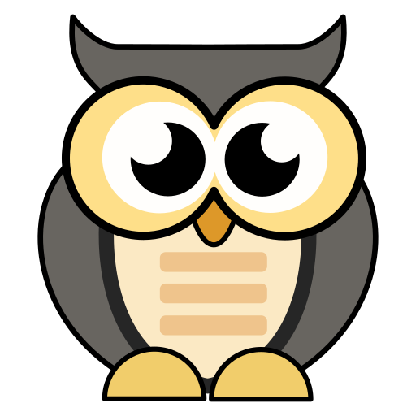

# Owl Blogs

A simple web server for blogs generated from Markdown files

## Repository

A repository holds all data for a web server. It contains multiple users.

## User

A user has a collection of posts.
Each directory in the `/users/` directory of a repository is considered a user.

### User Directory structure

```
<user-name>/
  \- public/
       \- <post-name>
            \- index.md
                -- This will be rendered as the blog post.
                -- Must be present for the blog post to be valid.
                -- All other folders will be ignored
            \- incoming_webmentions.yml
                -- Used to track incoming webmentions
            \- outgoing_webmentions.yml
                -- Used to track outgoing webmentions
            \- media/
                -- Contains all media files used in the blog post.
                -- All files in this folder will be publicly available
            \- webmention/
               \- <hash>.yml
                    -- Contains data for a received webmention
  \- meta/
       \- base.html
            -- The template used to render all sites
       \- config.yml
            -- Holds information about the user
       \- VERSION
            -- Contains the version string.
            -- Used to determine compatibility in the future
  \- media/
       -- All this files will be publicly available. To be used for general files
       \- avatar.{png|jpg|jpeg|gif}
            -- Optional: Avatar to be used in various places
       \- favicon.{png|jpg|jpeg|gif|ico}
            -- Optional: Favicon for the site
```

### User Config

Stored in `meta/config.yml`

```
title: "Title of the Blog"
subtitle: "Subtitle of the Blog"
header_color: "#ff0000"
author_name: "Your Name"
me:
  - name: "Connect on Mastodon"
    url: "https://chaos.social/@h4kor"
  - name: "I'm on Twitter"
    url: "https://twitter.com/h4kor"
```

### Post

Posts are Markdown files with a mandatory metadata head.

- The `title` will be added to the web page and does not have to be reapeated in the body. It will be used in any lists of posts.
- `description` is optional. At the moment this is only used for the HTML head meta data.
- `aliases` are optional. They are used as permanent redirects to the actual blog page.
- `draft` is false by default. If set to `true` the post will not be accessible.
- `reply` optional. Will add the link to the top of the post with `rel="in-reply-to"`. For more infos see: [https://indieweb.org/reply](https://indieweb.org/reply)

```
---
title: My new Post
Description: Short text used in meta data (and lists in the future)
date: 13 Aug 2022 17:07 UTC
aliases:
     - /my/new/post
     - /old_blog_path/
draft: false
reply:
     url: https://link.to/referred_post
     text: Text used for link
---

Actual post

```

### Webmentions

This feature is not yet full supported and needs a lot of manual work. Expect this to change quiet frequently and breaking existing usages.

To send webmentions use the command `owl webmention`

Retrieved webmentions have to be approved manually by changing the `approval_status` in the `incoming_webmentions.yml` file.

#### incoming_webmentions.yml

```
- source: https://example.com/post
  title: Example Post
  approval_status: ["", "approved", "rejected"]
  retrieved_at: 2021-08-13T17:07:00Z
```

#### outgoing_webmentions.yml

```
- target: https://example.com/post
  supported: true
  scanned_at: 2021-08-13T17:07:00Z
  last_sent_at: 2021-08-13T17:07:00Z
```
